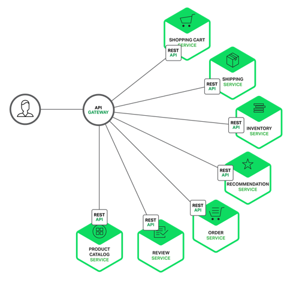
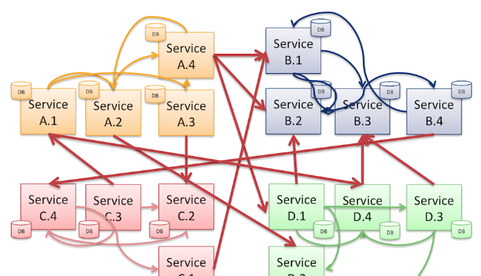
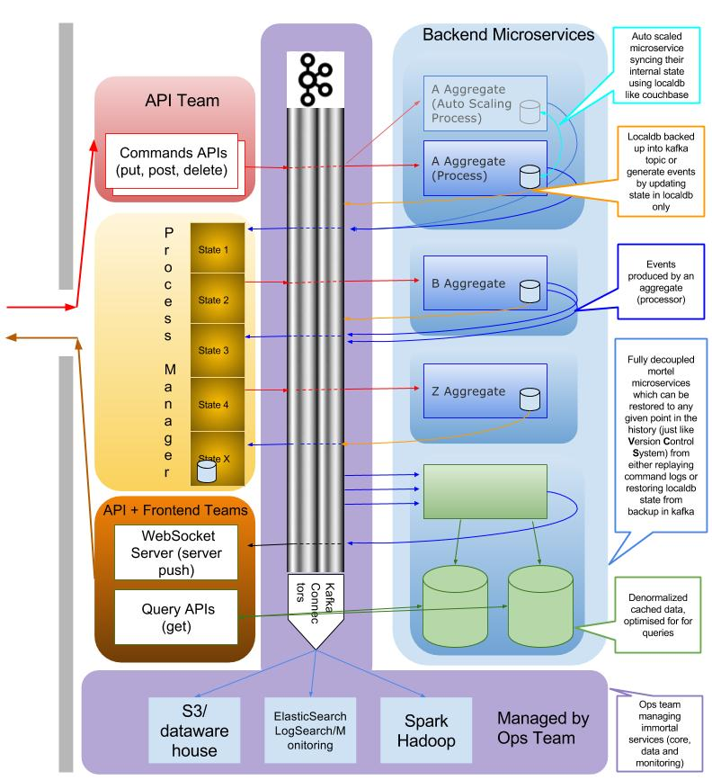

### What is Event Sourcing.
If you are a software developer then you are already using event sourcing (GIT, Subversion etc).  If you are DBA then you are already using event sourcing (Replication log). If you in an Operations engineer then you are already using it (Application logs)

Event sourcing involves modelling the state changes made by applications as an immutable sequence or “log” of events. Instead of modifying the state of the application in place, event sourcing involves storing the event that triggers the state change in an immutable log and modelling the state changes as responses to the events in the log.

If you are new to event sourcing then maybe it is good idea to read this blog to understand it further. https://www.confluent.io/blog/making-sense-of-stream-processing/

### Why Event Sourcing and CQRS for Enterprise microservices architecture.

Microservices is the hot new buzzword, that started out as a new way to build for the massive scale of internet companies like Netflix, Google etc. But what could go wrong if internet companies are using those and has great successes? 

>“People try to copy Netflix, but they can only copy what they see. They copy the results, not the process” - Adrian Cockcroft, former Netflix Chief Cloud Architect

Most of the non-internet enterprises don’t have scale problems of an Internet startup, their systems are often significantly more complex, and their organization are even more so. Microservices don’t seek to solve any other problem than how to break up work into smaller parts and how to scale up those parts as necessary.  

*Simple microservices layout.* 
 

It wouldn't take long when microservices start looking like this. 

*Microservices spaghetti diagram.*

API based approach introduced a great deal of complexity when implementing business transactions involving several services, so we struggled to continuously deliver changes in an efficient and safe manner. Handling a failure in any of the participating service required careful consideration.

Testing strategy required depending services to be stubbed, so as to be able to contract-test one service in isolation from the others. Each service had a stub, with its own code repository and deployment pipelines. Stubbing each service, dramatically increased the number of services to manage, and had to create dedicated environments where each service only depends on stubs for contract-testing.

High services coupling prevented releasing them independently from one another. You ended up with a “monolithic” release process where all services are deployed simultaneously, alongside the client application.

​

Instead of turning this readme into another blog, here are some good blogs explaining the issue in much more detail...
* http://blog.christianposta.com/microservices/the-hardest-part-about-microservices-data/. ​
* https://www.thoughtworks.com/insights/blog/scaling-microservices-event-stream. 
* https://www.ibm.com/developerworks/cloud/library/cl-build-app-using-microservices-and-cqrs-trs/
* https://www.confluent.io/blog/data-dichotomy-rethinking-the-way-we-treat-data-and-services/
* https://www.infoq.com/articles/microservices-aggregates-events-cqrs-part-1-richardson
* https://www.infoq.com/articles/microservices-aggregates-events-cqrs-part-2-richardson
* (https://youtu.be/7kX3fs0pWwc)

### Links to understand CQRS
* http://danielwhittaker.me/2014/11/15/aggregate-root-cqrs-event-sourcing/
* https://msdn.microsoft.com/en-us/library/jj591569.aspx
* https://msdn.microsoft.com/en-us/library/jj591577.aspx

### How I am planning to implement this concept.

#####What are we going to use? 
* Docker for local dev environment
* Kafka (Going to use Kafka for to reasons 1. Kafka Stream feature 2. Library support for different languages)
* ZoopKeeper 
* [Apache Avro](https://github.com/confluentinc/schema-registry)
* Code in NodeJs or Go or Java Lambda

